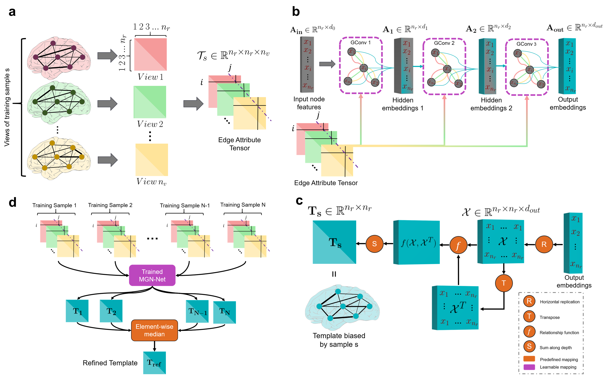

# Multiview Graph Normalizer Network (MGN-Net)
How to integrate a set of brain multi-graphs into a single graph?

Please contact mustafaburakgurbuz@gmail.com for inquiries. Thanks. 



# Introduction
This work is accepted to journal of Medical Image Analysis.

> **MGN-Net: a multi-view graph normalizer for integrating heterogeneous biological network populations**
>
> Mustafa Burak Gurbuz and Islem Rekik
>
> BASIRA Lab, Faculty of Computer and Informatics, Istanbul Technical University, Istanbul, Turkey
>
> **Abstract:** *With the recent technological advances, biological datasets, often represented by networks (i.e., graphs) of interacting entities, proliferate with unprecedented complexity and heterogeneity. Although modern network science opens new frontiers of analyzing connectivity patterns in such datasets, we still lack data-driven methods for extracting an integral connectional fingerprint of a multi-view graph population, let alone disentangling the typical from the atypical variations across the population samples. We present the multi-view graph normalizer network (MGN-Net1), a graph neural network based method to normalize and integrate a set of multi-view biological networks into a single connectional template that is centered, representative, and topologically sound. We demonstrate the use of MGN-Net by discovering the connectional fingerprints of healthy and neurologically disordered brain network populations including Alzheimer’s disease and Autism spectrum disorder patients. Additionally, by comparing the learned templates of healthy and disordered populations, we show that MGN-Net significantly outperforms conventional network integration methods across extensive experiments in terms of producing the most centered templates, recapitulating unique traits of populations, and preserving the complex topology of biological networks. Our evaluations showed that MGN-Net is powerfully generic and easily adaptable in design to different graph-based problems such as identification of relevant connections, normalization and integration.*

## Code
This code was implemented using Python 3.8 (Anaconda) on Windows 10.
```diff
 You can edit config.py file to configure our MGN-Net according to your needs.
```

## Installation
### *Anaconda Installattion*
* Go to  https://www.anaconda.com/products/individual
* Download version for your system (We used Python 3.8  on 64bit Windows 10 )
* Install the platform
* Create a conda environment by typing:  ```conda create –n MGN_Net pip python=3.8 ```

### *Dependency Installattion*
Copy and paste following commands to install all packages (CPU version)
```sh
$ conda activate MGN_Net
$ conda install pytorch torchvision torchaudio cpuonly -c pytorch
$ pip install scikit-learn
$ pip install matplotlib
$ pip install torch-scatter -f https://pytorch-geometric.com/whl/torch-1.8.0+cpu.html
$ pip install torch-sparse -f https://pytorch-geometric.com/whl/torch-1.8.0+cpu.html
$ pip install torch-cluster -f https://pytorch-geometric.com/whl/torch-1.8.0+cpu.html
$ pip install torch-spline-conv -f https://pytorch-geometric.com/whl/torch-1.8.0+cpu.html
$ pip install torch-geometric
```
This is all for CPU installation, please visit (optional) PyTorch-Geometric’s web page (https://pytorch-geometric.readthedocs.io/en/latest/notes/installation.html) for description on installing GPU version. Code will check the version of dependencies and availability of GPU. If everything is configured correctly, it will utilize GPU automatically.

## Data format
In case you want to use MGN_Net on your multiview networks, we represent each multiview brain network with a stacked symmetrical connectivity matrices. Therefore our model expects you to provide a path of numpy array saved as a binary file in NumPy .npy format with shape [#Subjects, #Nodes, #Nodes, #Views]. For our case network nodes were regions of interest in the brain, however, any type of node is a valid input. If your networks are single view, you can simply set #Views to 1.  

## Run MGN_Net
To run our code, open up a terminal at MGN_Net’s directory and type in
```sh
$ conda activate MGN_Net & python main.py
```
#####  You may edit config.py to tune hyperparameters, configure training or supply your own dataset.

## Components of MGN_Net’s Code
| Component | Content |
| ------ | ------ |
| config.py | Includes hyperparameter and other options. You may modify it according to your needs. |
| model.py | Implementation of the model. |
| main.py| Driver code that import variables from config.py and trains MGN_Net (cross-validation).  |
| helper.py| Includes some helper functions |
| output/<model name>/ | After the training, this directory includes model parameters, final CBT, and subject biased CBTs for each fold. |
| temp/ | Includes interim model parameters that are saved for each 10 epoch. Deleted after the training.  |
#####  output/<model name>/ and temp/ directories created by main.py
  
## Example Result  

The figure demonstrates an example of output for a population of 37 subjects where each subject has 4 views (each represented by 35 by 35 matrix). Our code takes in a numpy array of size [37, 35, 35, 4] and outputs a 35 by 35 matrix.


## Relevant References
Fey, M. & Lenssen, J. E. Fast graph representation learning with PyTorch Geometric. In ICLR Workshop on Representation Learning on Graphs and Manifolds (2019).

Adam Paszke, Sam Gross, Soumith Chintala, Gregory Chanan, Edward Yang, Zachary DeVito, Zeming Lin, Alban Desmaison, Luca Antiga, and Adam Lerer. Automatic differentiation in pytorch. In NIPS-W, 2017.


## Please cite the following paper when using MGN-Net
```latex
  @article{gurbuzrekik2021,
    title={MGN-Net: a multi-view graph normalizer for integrating heterogeneous biological network populations},
    author={Gurbuz, Mustafa Burak and Rekik, Islem},
    booktitle={Medical Image Analysis},
    year={2021},
    organization={Elsevier}
  }
```
